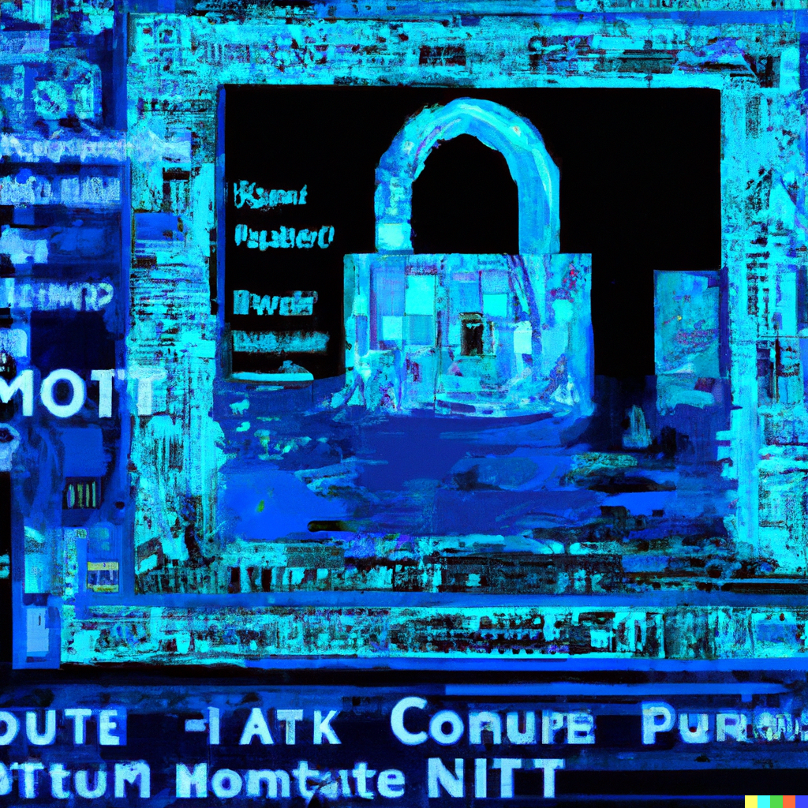

# Programowanie Web3 - Fundamenty Blockchain i Solidity

Lekcja 3 kursu Programowanie Web3 - Fundamenty Blockchain i Solidity.

Stworzenie pierwszego smartcontractu o funkcjonalności tokenu ERC-20.

## Zawartość

To repozytorium stworzone jest za pomocą biblioteki Foundry, o której uczyć będziemy się na kolejnej lekcji. Na ten moment wystarczy podążać za poniższymi instrukcjami, a z tego repozytorium istotny może być tylko ewentualnie plik `/src/PierwszyToken.sol`, który zawiera kod wygenerowany przez aplikację Wizard OpenZeppelin.

## Instalacja i konfiguracja

1. Zainstaluj Metamask: https://metamask.io/
2. Zmień sieć testową na Sepolia. Jeżeli nie ma jej na liście kliknij w "Show test networks" lub wejdź na stronę https://chainlist.org/chain/11155111 i kliknij "Connect wallet" i potwierdź prośbę o dodanie nowej sieci
3. Uzyskaj testowe Ethery poprzez jedno ze źródełek. Ich listę znajdziesz na: https://ethereum.org/en/developers/docs/networks/ -> Sepolia - > Faucets

## Uruchomienie

1. Wejdź na stronę https://wizard.openzeppelin.com/
2. Wybierz zakładkę "ERC20"
3. Uzupełnij odpowiednio poniższe pola:

- Name: PierwszyToken
- Symbol: PTOK
- Premint: 100

4. Zaznacz opcje: Mintable, Burnable, Pausable, Ownable
5. Kliknij kolejno "Open in REMIX"
6. Kliknij "Compile contract ...."
7. Przejdź do zakładki "Deploy & run transactions"
8. Kliknij "Deploy"
9. Przetestuj działanie kontraktu za pomocą wywołań funkcji z poziomu panelu "Deployed Contracts" w tej samej zakładce
